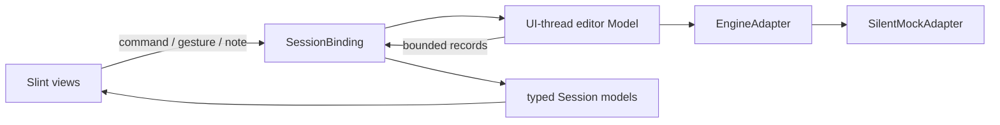

# Advanced Sampler native editor contract

The Slint standalone uses the C++20 editor model in `ui/advanced-sampler/engine/`. Its adapter is explicitly a **silent mock**: it exercises editing, preparation states, MIDI ownership and diagnostics without claiming to render DSP or connect the Rust/JUCE audio engine.



`Session.command(action, target, text, value)` returns whether the command was accepted. `Model::commandIds()` is the authoritative registry. Unknown commands and invalid targets return false. Presentation code must use these callbacks rather than maintaining a second editable patch.

Examples:

```slint
Session.command("fx.set", "comp", "threshold", -24);
Session.command("asset.import-many", "root-velocity", wav-paths, 48);
Session.command("route.scope", route-id, "shared", 0);
```

The four multi-file import modes are `sequential`, `root-velocity`, `stack` and `round-robin`; paths are newline-separated. WAV import/relink reads real RIFF PCM or float data, validates the format and stores metadata, signed waveform buckets and bounded zero-crossing positions. Imported asset completion joins its original undo command. Missing and unsupported files remain explicit states. Preview assets in reference fixtures are labeled cached mock data.

The application has a Slint `DropArea` and a native `DataTransfer` file boundary. One path enters single-sample import; multiple paths open the mapping chooser before any edit. Transfer inspection preserves history, rejects text/ambiguous paths, and bounds input to 256 paths/64 KiB. Native callback and chooser tests exercise this boundary; external desktop file delivery is still awaiting platform verification and is not covered by those tests.

`Model::parameterInfo(id)` provides one validated descriptor for global parameters and encoded processor, modulator and mapped-pad targets. For example, `fx:comp:threshold` and `pad:38:pan` work with `parameter.set`, `parameter.reset`, `parameter.learn`, `parameter.host`, `macro.bind` and `route.add`. The descriptor carries actual units, bounds, defaults and automation state; unmapped pads and unknown fields are rejected. MIDI bindings remain separate from macro destination rows.

`Session.parameter-catalog` includes bounded, validated global, processor, modulator and mapped-pad descriptors for the native destination pickers. The ordinary `parameters` model retains its global-only contract.

`source-groups` projects each source group once, including noncontiguous records, with independent disclosure state. `asset.group-toggle` changes presentation only. Slices retain their source ID independently of the selected asset; `slice.preview` auditions their stored source/position without owning a MIDI note. `slice-source(slice-sources, id)` reads the explicit projected ownership model and returns the persisted owner or an empty string for an invalid ID. Tracking model changes keeps grouped rows reactive when only provenance changes.

`zone.paste` and `zone.paste-layer` accept a negative destination to paste immediately after the selected key range, or at C4 when no range is selected. Explicit destinations remain MIDI note numbers.

All numeric parameters use their native units. Frequency is Hz, time is ms where the descriptor says ms, pitch is semitones, gain is dB, and normalized percentages are 0–1. Slint controls convert percentages for display. Processor descriptors come from `Model::processorParameters()` and define valid fields, defaults and bounds; an arbitrary processor field is rejected.

Gestures use phases 0 begin, 1 update, 2 commit and 3 cancel. Updates coalesce into one undo entry; cancellation restores every changed field. `gesture.cancel` rolls back the one active native gesture, preserving exact stored values and Undo history; it also accepts an idle cancellation. IDs include ordinary parameter/macro IDs and `zone:<id>:<field>`, `slice:<id>:start`, `pad:<note>:<field>`, `binding:<macro>:<destination>`, `fx:<id>:<field>`, `module:<id>:<field>`, `route:<id>:<field>` and `modulator:<id>:<field>`. Sample region/loop/fade IDs are direct names such as `region-start`. During an active gesture, `parameter.preview` adds a companion parameter to the same command, enabling two-dimensional filter and envelope handles.

Hybrid presets also include the initial six-parameter Lush card (Level, Pan, Tune, Detune, Brightness and Width). Added Voice sources are typed Noise, Oscillator, Sampler and Synth patch cards. Their parameters and mode choices persist through native commands and Undo. The cached `lush` source uses kind `synth-patch` and explicitly labels its silent mock preview. Removing an asset removes its mappings and operation references in one undo command; it never deletes the original file.

Sample operations store their effective settings and source provenance. Bypass, removal and reorder recompute the affected source setting; the Source baseline cannot be bypassed, removed or moved. Normalization computes gain metadata from imported waveform peaks, while the silent adapter continues to produce no audio.

Notes use `note-on(note, velocity, owner)` and `note-off(note, owner)`. The owner identifies the physical pad/key/drawer source; releasing one source cannot stop another source holding the same pitch. Keyboard guards reject text-entry and modified shortcuts, store the pitch captured on key-down, and release captured notes before octave or patch changes. `release-notes()` is the window lifecycle boundary. Telemetry and historical diagnostic traces are bounded and generation-tagged adapter results reject stale generations.

Undo stores changed records and their original row positions, not copies of the entire Session. Structural edits expose a preparation-pending state; explicit reload starts generation-tagged preparation. Analysis and freeze/autosampler/collapse jobs currently run through the mock UI clock. Freeze and collapse produce labeled derived mock assets; they do not perform offline DSP rendering. Pitch/loudness analysis results are mock results, while WAV metadata, waveform and zero-crossing import are real.

The exported patch format is `DANDRUM-SAMPLER 1`, followed by bounded quoted records. It round-trips persistent editor state and excludes transient telemetry. It is an editor definition, not the Rust engine's YAML graph. MIDI slice export writes a real Standard MIDI File. Host automation and MIDI learn use the mock adapter contract and do not advertise a connected host.

`Bindings.h` retains the window lifetime and reuses row models across refresh, including nested processor parameters, to preserve focus and pointer capture. Models are refreshed on the UI thread; no GUI dependency enters the headless Model or an audio callback.

Verification lives in `AdvancedSamplerModelTest.cpp` and native generated binding/page tests under `tests/cpp/`. The pure model needs no display. Native binding tests use Slint's testing backend; screenshot/window suites use a private authenticated Xvfb display. Reference `selectState()` fixtures are separate from ordinary preset loads and never replace native command behavior.

The mapping context command `zone.context-select` resolves note/velocity hits with the selected matching zone preferred. `zone.insert` splits that range and creates an empty sample slot; `zone.add-gap` uses neighbouring velocity-compatible ranges. Empty slots report `empty` diagnostics rather than a cached-source success. Clipboard availability is projected from actual copied zone records.

Selector axis configuration uses `selector.axis` (`vel`, `macro`, `mod`, `key`) and `selector.source` (a valid macro or modulator for that axis). The mock selector consumes the configured input when choosing candidates. `selector.no-repeat` changes random/weighted immediate-repeat policy while preserving zero-weight exclusion; `selector.lock` persists the take-lock configuration. Articulation, release-trigger and pedal-aware-release settings are editor configuration; they add no DSP implementation.

FX chains project actual tree-group and output-bus parents through `fx-chains`; processor moves stay inside their parent chain and boundary moves are no-ops. Pitch analysis is a labeled mock result: root C4 and fine +3 cents. Apply writes the analyzed source root and the existing global Fine parameter in one Undo; changing selected source rejects a stale pitch Apply.
