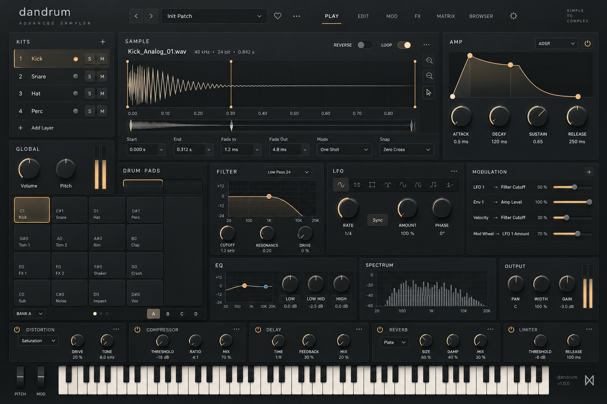

# DanDrum Soft Precision design reference

**Soft Precision** is the DanDrum design direction: a charcoal background, subtly raised gradient panels, fine edge highlights, soft shadows, understated tactile controls, a warm amber accent, and a three-tone palette.

## Reference image

The image is preserved unchanged as the visual reference for this direction.

## Visual direction

- **Background:** charcoal, with a calm, low-contrast foundation.
- **Panels:** subtle gradients and slightly raised edges, defined by fine highlights and soft shadows.
- **Controls:** understated and tactile, with clear contrast for labels, values, and active states.
- **Accent:** warm amber for emphasis and active controls.
- **Palette:** three principal tones, with restrained variation for depth and legibility.

## Provenance

- Source: [Generate DAW Grid Styles](https://chatgpt.com/c/6ac76fe8-1fa0-83ec-b124-7484c81d938a), latest exported image attachment.
- Library asset: [DanDrum Soft Precision design reference](https://chatgpt.com/space/page_d298145a9b5881919532a1aa20db0718).
- Original attachment filename: `generated-image.png`.
- Saved filename: `dandrum-soft-precision-dark-minimalist-sampler-ui.png`.
- Saved on: 8 October 2026.
- Original format and dimensions: PNG, 1536 × 1024 pixels.
- SHA-256: `AF7F2DBDFA04B07E3E837674188D12727287DBEA9C61B15B01FC1D2F478BF9A6`.

The saved image and the source attachment have identical SHA-256 hashes. No cropping, resizing, recolouring, or re-encoding was applied.
