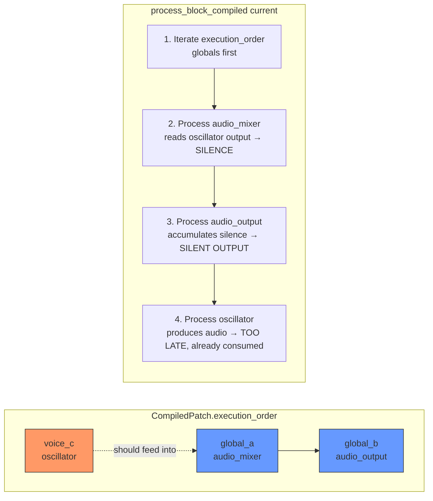
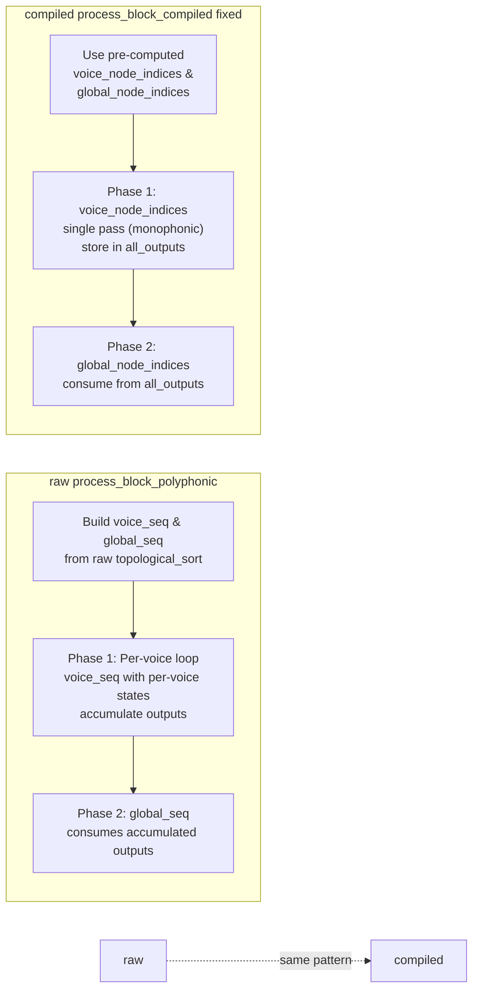

# Execution Flow Diagrams

## Current Bug — Global Consumer Runs Before Voice Producer



## Fixed — Two-Phase Voice-Then-Global Processing

```mermaid
flowchart LR
    subgraph CompiledPatch unchanged
        direction LR
        EO[execution_order<br/>globals → voices<br/>unchanged]
        VI[voice_node_indices<br/>[voice_c]]
        GI[global_node_indices<br/>[audio_mixer, audio_output]]
    end

    subgraph process_block_compiled fixed
        direction TB
        Seed["Phase 0: Seed MIDI/events<br/>into all_outputs"]
        Phase1["Phase 1: Iterate voice_node_indices<br/>Process oscillator → store in all_outputs"]
        Phase2["Phase 2: Iterate global_node_indices<br/>audio_mixer reads oscillator from all_outputs<br/>audio_output reads mixer from all_outputs"]
        Extract["Extract left/right from<br/>audio_output in all_outputs"]
    end

    Seed --> Phase1 --> Phase2 --> Extract

    VI -.-> Phase1
    GI -.-> Phase2

    style Phase1 fill:#f96,stroke:#333
    style Phase2 fill:#69f,stroke:#333
```

## Comparison — Raw Polyphonic vs Compiled (Fixed)



## Summary

| Diagram | Content |
|---------|---------|
| 1 — Current Bug | `execution_order` iterates globals first → `audio_mixer` reads voice oscillator's not-yet-computed output → silence |
| 2 — Fixed | `process_block_compiled` uses two phases: voice phase first (produce + store), then global phase (read stored + consume). `execution_order` stays unchanged |
| 3 — Comparison | The fixed compiled path matches the same two-phase pattern already proven in `process_block_polyphonic` |
