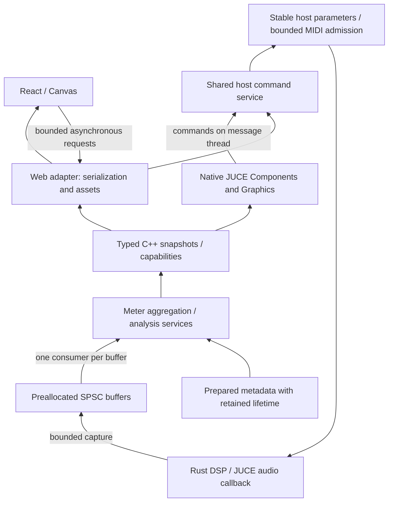

## Context

The reviewed design export is preserved in [docs/design-system/reference](../../../docs/design-system/reference/). Its [maintained guide](../../../docs/design-system/README.md) records visual decisions, provenance and adaptation rules. The sampling and original UI proposal histories are integrated into main at `0b99819`; this refresh updates design references without implementing a renderer.

See [proposal.md](proposal.md) for scope and pinned evidence. The fetched sampler revision owns prepared sample metadata independently of source inputs and already supports shared/per-pad host controls. Its plugin UI is still embedded HTML with a browser-specific bridge and editor lifetime. No renderer-independent UI change exists at that revision, so this proposal introduces a separate follow-on change rather than altering the archived engine contract.

The revised export broadens the visual vocabulary to key maps, layered synth/sample/patch sources, module chains, sends and outputs. Those displays do not establish new engine capabilities. In particular, a sample map's round-robin alternatives are not simultaneous source layers, and arbitrary patch layering is not implied by drawing overlapping rectangles.

## Goals / Non-Goals

**Goals:** implement a browser-independent C++ presentation boundary, two proven renderer paths, asynchronous analysis and bounded telemetry, with evidence that visualization cannot make audio wait on consumers. Support automatic muted structural rebuilds while preserving current sampler automation identities, live parameter bindings and external authoring.

**Non-Goals:** add a general YAML/graph editor, draft/Apply workflow, seamless engine transitions, overlapping engine rendering, state migration, background live preview, in-plugin modulation assignment, implicit synth/patch layering or host routing features, replacement sampling primitives, or guaranteed scheduling against arbitrary operating-system contention. Hosts own plugin callback scheduling; this design controls dependency, resource and callback-work bounds.

## Decisions

### Shared typed state precedes either renderer

The shared presentation library contains C++ value types, command validation, operation state, analysis coordination and format-neutral results. It has no browser, JSON, DOM, `juce::Graphics` or image-type dependency. A JUCE host adapter owns APVTS integration, file selection and message-thread dispatch. Rust retains the target-neutral engine and typed preparation model behind C FFI.

The native renderer consumes typed snapshots; the Web adapter serializes them only after leaving the realtime boundary. Do not route native controls through JavaScript, an embedded browser, or JSON. Duplicating a controller in each renderer would make gesture, generation and lifetime semantics drift; sharing drawing code across C++ and React would overconstrain both.

Processor-owned realtime storage remains valid independently of any editor. Each queue has exactly one producer and one consumer; fan-out to renderer subscribers happens after consumption. A view session owns subscriptions and command state, not the active engine. Analysis uses retained immutable sample ownership or an off-audio-thread copy; neither renderer nor worker retains an unprotected pointer into a replaceable instrument. Allocation release and the final destruction of retained assets occur off the audio callback.

### Separate documents, commands and visual frames

Prepared documents describe stable source/region/zone IDs, actual control groups, parameter descriptors, supported source/layer/routing metadata and actual host bus/channel layout. Documents and replies carry instrument generation; a renderer session ID distinguishes a reopened editor within that generation. Live frames additionally carry stream ID, sequence, audio sample position and validity/gap flags.

Example command names are `beginGesture`, `setParameter`, `endGesture`, `noteOn`, `noteOff`, `editStructure`, `reloadInstrument`, `requestWaveform`, and `requestSpectrogram`. Native calls enter the same service directly on the message thread; browser requests add transport identifiers. Validate finite normalized values and capabilities. An accepted parameter write means the host value was admitted, not that an audio block has processed it. Structural edits/reload/analysis return job IDs and publish durable terminal states queryable after reconnect.

Coalesce continuous pointer values while retaining their final value and gesture boundaries. Parameter notifications update authoritative state without emitting another command. Track admitted command sequence and generation to prevent delayed echoes from undoing a newer local edit. Rejection reconciles the optimistic display to authoritative state. Timeouts/disconnects clear bounded browser promises; do not automatically retry non-idempotent note or job requests.

Audio-originated parameter listeners may only publish atomic values/dirty flags for timer observation. The vendored JUCE `ParameterAttachment` calls `triggerAsyncUpdate()` for off-message-thread notifications; do not assume that is compatible with the strict no-posting callback requirement. Use a covered timer-observed binding for both renderers and perform host begin/update/end gesture calls on the message thread. JUCE [documents that AsyncUpdater can block when posting](https://docs.juce.com/master/classjuce_1_1AsyncUpdater.html).

Maintain release intent outside lossy telemetry: for example, use a preallocated per-note release mailbox and editor-session release generation drained by audio. Serialize note admission on the message thread and preserve ordering between queued note-ons and later disconnect/release intent, so saturation cannot leave an editor-owned gated note stuck. Specify/test the chosen ordering before implementation; it does not change timestamped host MIDI delivery.

### Capability-aware design-system views

Keep one maintained semantic token source and generate CSS and a C++ token header. Reuse the supplied icons and licensed fonts. Add native component specifications for KeyMap, LayerStack and OutputBusses: the new export supplies React sources/types/examples for these but no updated native handoff.

| View | Shared data | Runtime interaction |
| --- | --- | --- |
| KeyMap | Actual key/velocity ranges, source identity, selection/layering mode, root note | Select/audition; supported structural edits automatically rebuild |
| LayerStack | Supported prepared source/chain descriptors and public control bindings | Inspect; live bound parameters; supported structural edits automatically rebuild |
| OutputBusses | Actual named host bindings, channel counts, feeds when available | Inspect/meters; supported internal route edits automatically rebuild; no fabricated output pairs |
| Knob / Slider | Public ID, normalized/actual value, range, units, scope | One complete host gesture; keyboard and typed entry |
| Waveform / spectrum | Numeric analysis plus frame/rate/settings metadata | Inspect cached data, overlay observed cursor |

Enable a structural interaction only when its typed command and instrument capability are implemented; otherwise keep it read-only. Audit LayerStack/OutputBusses callbacks individually; a single exported prop is not proof that every action is gated. A reference component must not silently mutate local configuration. Supported changes enter the automatic rebuild transaction below. Live gain, mute, bypass and sends require actual public bindings; arbitrary module internals do not become host controls merely because the reference displays them.

### Structural edits automatically mute, rebuild and resume

**Decision:** structural edits take effect automatically through one processor-owned replacement job. There is no separate authoring draft, Apply button, confirmation or collection of unapplied changes. This user decision supersedes this proposal's previous external-only restriction. External file authoring remains possible; each installed prepared definition is still immutable.

1. **Admit and mute:** the shared command service checks the edit's generation, supported operation and absence of another rebuild. Immediately close the plugin's atomic audio-access gate and mute its output before beginning configuration validation or preparation. Return the job identity and publish rebuilding state; disable structural controls in every open editor. Unknown/stale/unsupported commands are rejected without changing the working configuration.
2. **Quiesce safely:** a preallocated callback reader guard and explicit acknowledgement prevent engine retirement until any callback that already acquired the old engine has left it. A callback beginning after gate closure clears every plugin output and returns without acquiring an engine. The coordinator may wait off audio for an existing reader; audio never waits for the coordinator, a lock or a worker. The handoff must work when the host stops issuing callbacks. A mute flag, `suspendProcessing`, pointer exchange or fixed sleep alone does not prove quiescence.
3. **Validate and rebuild off audio:** retain the last working configuration and its dormant engine under coordinator ownership. Validate the edited configuration, resolve assets, compile and prepare the candidate on a worker. Only one rebuild executes; another structural request is rejected as busy rather than queued for later application. Partial candidates, temporary resources and retained assets are reclaimed off audio.
4. **Activate and resume:** off audio, verify that generation and host preparation settings still match and that the existing public host surface is compatible. Reconcile current public parameter values, transfer the prepared candidate to the callback ownership slot, publish its owned prepared document and new generation, reopen the gate and unmute automatically. Retire the previous engine off audio after reader safety is established. Voices, held notes, queued audition and effect tails may reset; do not replay notes accumulated while muted.
5. **Recover on failure:** validation, asset loading, compilation, worker startup or activation failure restores access to the last working engine and configuration, retains its displayed generation, unmutes and re-enables structural controls automatically. Publish a persistent job error to either renderer and reconcile displays to the working configuration. Clean failed candidates off audio. No failure waits for user confirmation or leaves a hidden pending edit or a permanent mute.

The DAW transport keeps running. Muting affects only this plugin instance; it does not request host stop/pause or suspend other instruments. Blocks started after edit admission return silence throughout quiescing, validation and preparation. An already running block may finish before acknowledgement; the coordinator cannot reclaim or mutate its engine during that interval.

The first implementation accepts only edits compatible with the existing exposed public surface. Preserve host parameter objects, IDs, count/order, slot assignments and automation bindings; reject a structural edit that adds/removes/renames/reorders exposed parameters or changes their host ranges. Internal structures may change only through supported engine capabilities. Ordinary cutoff, volume and other exposed changes continue on normal live bindings without a rebuild or mute. During a rebuild, retain the latest host values and install them in whichever engine resumes; do not overwrite automation arriving during preparation with an earlier snapshot.

The rebuild coordinator outlives editor sessions. Closing/reopening an editor cannot strand a rebuild or leave output muted; a new editor queries processor-owned status. Serialize ownership changes with explicit reload, file-watcher replacement, state restoration and host preparation; those paths must not independently retire an engine that the coordinator retains. Reload uses the same muted preparation/handoff path. Processor shutdown waits for and reclaims worker/engine resources off the audio callback. Copied prepared documents and retained analysis samples remain safe, and obsolete generation results cannot replace the activated document.

The current reload path prepares before installation and uses a fixed delay before old-engine destruction. Its existing tests are baseline evidence, not proof of this new handoff or immediate-muted-rebuild contract. [Structural acceptance tests](structural-authoring-acceptance-tests.md) define the additional behavioral oracles and required executable regressions.

The maintained kit's snare split is 63/64 and its controls include per-pad scopes. Use those live descriptors in acceptance fixtures. Never replace them with the export's 95/96 demo split, artificial layering, hardcoded module chains, simulated activity or claimed host modulation sources.

### Concrete visual direction comes from the reviewed export

Use warm brown surfaces (`#130F0C` through `#524437`), cream primary text
(`#F2E6D3`) and the ember selection/action accent (`#E08A4E`). Preserve existing
`vermilion` token identifiers. Barlow Semi Condensed labels, Barlow titles and
JetBrains Mono values follow the supplied typography; obtain font binaries and
license notices before production packaging because neither is in the export.

Knobs have a pointer-free cap, a 270-degree value arc and an editable value popup
on hover, focus or drag. Resolve the old handoff's pointer/permanent-label examples
in favour of these current brand rules. Use collapsible panels, prepared-detail
rollouts, a 2-pixel cream focus ring with a 2-pixel gap, and the supplied 1200 x 800
and 820 x 560 layouts. Flat fills and dynamic drawing supply the interface;
waveforms, labels, activity and meter values are never baked into assets.

Keep the supplied HTML/CDN/Babel previews as design references. They are not the
production asset pipeline. The imported CSS and C++ token outputs do not complete
the planned shared generator, and the new display views still require native
component specifications. Engine metadata and the capability/automatic-rebuild
rules above determine which interactions a production editor can expose.

### Telemetry has explicit work and memory bounds

Prepare fixed-capacity capture queues and maximum tap/channel counts before processing. First implement master/output metering; per-layer or per-voice taps require an explicit capability and preparation budget. Measure peak and sum-of-squares per block or during an existing output pass. Aggregate by sample count, including partial/variable blocks. Use double precision for aggregate energy where useful outside the callback and verify silence, signed values and non-finite-input handling.

Queue-full handling rejects the new visual frame and increments a bounded counter. The producer must not discard an old element by changing a consumer-owned index. The consumer may discard stale backlog. A single consumer then distributes a coherent snapshot to either renderer. Keep clipping in an independent lock-free latch/counter with generation-aware acknowledgement; define reset ownership so a reset cannot erase a newer clip occurrence. Verify the atomics used are lock-free on supported build targets.

Start presentation at 30 Hz, with configurable bounded capture/analysis rates. Native painting and browser animation interpolate visually using elapsed time and measurement timestamps. A Web adapter keeps at most one unacknowledged telemetry payload and one replacement snapshot per stream; while blocked it coalesces rather than queues more browser messages. Give commands and job status their own bounded admission/status path. Hidden/disconnected sessions release subscriptions; workers stop unnecessary analysis and audio sees an atomic capture-enabled flag without freeing storage.

Low-priority, bounded worker execution reduces contention; asynchronous execution alone is insufficient. Cap worker count and cache memory, chunk static work, cancel stale jobs and benchmark multiple plugin instances. Never spin indefinitely, issue a system wake/message from audio, or join a worker in a callback. Timers/polling outside audio consume queues. Worker-to-message-thread notification may use ordinary async mechanisms with cancellation-safe receiver ownership.

### Share numeric waveform and spectral results

Use prepared sample content and source-frame coordinates. Waveform reduction produces per-channel min/max buckets for a specified frame range/resolution. Cache by content/revision, region, channel and reduction settings; pathname alone is insufficient. Changing the playhead updates an overlay only. UI values in seconds are derived from the source rate, while live cursor timestamps include host frame timing; support differing source and host rates.

Static spectrogram jobs initially use a Hann window, a documented power-of-two FFT size and hop, explicit magnitude normalization and dBFS floor, and a bounded frequency grid. Final settings and tolerances belong to tested metadata, not unexplained constants in a renderer. Share magnitude arrays; native `Image` and Canvas/WebGL texture caches are downstream renderer details. Reuse compatible existing analysis routines where their measurement contract matches.

Live scope capture can publish signed min/max envelopes. FFT input instead requires contiguous sample windows; do not FFT min/max envelopes or simply retain every Nth sample. Initially capture the subscribed mono/selected channel at full analysis rate; any subsequent downsampling requires anti-alias filtering and a declared effective sample rate. Include sample positions and gap flags. On loss, discard a partial FFT window rather than concatenate nonadjacent samples. Workers limit backlog and publish bounded numeric column batches. Canvas is the initial web drawing backend; adopt WebGL only if measurements warrant it.

### Make editor choice a build boundary

Separate common UI services, native components, and web transport/resources into build targets. Use an editor factory/configuration value independent of instrument data; remove compulsory HTML from the neutral demo description. A native-only build disables browser features and requires neither WebView SDKs/WebKit nor Node. The web configuration compiles React/CSS/fonts/icons ahead of time and embeds local assets via the resource provider. No production CDN scripts, runtime Babel or development server.

Both configurations keep the existing instrument/plugin identity and state schema. Package and test them independently; simultaneous installation of variants with the same plugin identity is not a supported selection mechanism. The initial proof needs build-time renderer selection, not hot-switching an editor during playback.

The supplied TB-303 React panel is an additional web client of the same asset and command path. Its seven prepared public controls bind by ID; the playable keyboard sends editor note events. The source mock's tuning, waveform, tempo, sequencer, transport, programmed steps and moving lights are presentation examples, not prepared capabilities. Replace the demo knob defaults with authoritative values, show fixed saw-wave preparation as read-only if exposed, and leave unsupported editing unavailable. No browser timer may claim to schedule audio steps or report host-driven playback without an observed transport/event capability.

## Risks / Trade-offs

- Host/OS scheduling and shared CPU/GPU resources can still cause contention -> bound resource use and report callback timing/deadline evidence under explicit workloads; avoid absolute scheduling promises.
- Rich mockups imply engine features not yet available -> capability-gate views and route supported structural edits through automatic replacement, preserving immutable prepared metadata.
- Immediate mute interrupts this plugin briefly -> allow voices/notes/tails to reset; keep the DAW running and automatically restore the working configuration on failure.
- Muting can hide an unsafe ownership race -> require an acknowledged callback handoff and off-audio cleanup; reject fixed-delay assumptions in acceptance tests.
- UI consumers can stall for arbitrary time -> bounded publication, independent clip/release state, reconnect snapshots and generation checks.
- Retained samples and spectral caches consume memory -> bound jobs/cache bytes and reclaim/cancel off audio; test reload and teardown while jobs are stalled.
- Pixel-identical renderers are expensive -> share semantic tokens and behaviour; verify readable, faithful full/compact layouts on each real runtime.
- Source-text checks alone miss indirect callback work -> combine static guards with runtime allocation/forbidden-operation instrumentation and stress measurements, stating platform limits.

## Migration Plan

1. Resolve repository publication/base state, then create one isolated task worktree based on the published sampling revision or its verified integrated successor. Do not reopen archived advanced-sampling tasks.
2. Characterize current host slots, gestures, MIDI admission, reload, sampler metadata and signed audio before extracting shared services. Keep the existing editor available until a replacement slice passes.
3. Implement typed shared state/commands and native-only build separation; prove one knob in native and web against identical host behaviour.
4. Add bounded metering and a real meter in both views, then prepared waveform data and both waveform renderers. Verify these three controls before expanding the sampler layout.
5. Add static spectral analysis, then subscribed live capture/analysis with gap handling and backpressure tests.
6. Specify structural acceptance tests first, then implement the acknowledged audio gate, one-worker rebuild/recovery and stable public-surface checks. Connect only supported structural controls in native and WebView to this transaction.
7. Compose the revised capability-aware KeyMap/LayerStack/OutputBusses views, preserving controls that the existing sampler exposes. Add native handoff details and offline packaging.
8. Run focused and full integration gates, record stress/visual evidence, map every new scenario to a proving test, then sync/archive through OpenSpec only after implementation is complete. Task checkboxes distinguish verified slices from pending implementation; the automatic structural rebuild tasks remain unchecked.

Rollback selects the previously verified editor build while preserving instrument identity and persisted state. Reverting presentation must not require reverting completed sampling-engine functionality.

## Verification Evidence Required

For deterministic functional tests, replay the same timed parameter/MIDI schedule with telemetry enabled, disabled and consumers stalled; compare to known signed samples as well as full-output equality. Test full queues, stale jobs, variable blocks, generation reuse/reconnect, editor closure during a note and gesture, source-content changes at the same path, and clip acknowledgement races.

For runtime evidence, test native and web separately at 1200x800 and 820x560 logical sizes, common display scaling, 44.1/48/96 kHz and small/normal/oversized blocks. Record baseline and enabled callback distributions, maximum duration, observable missed deadlines, capture losses, worker utilization and cache memory. Include multiple instances, analysis cancellation, resizing and repeated hide/open. Timing acceptance covers only the documented tested environment. Builds and deterministic PCM parity do not establish runtime visual or scheduling quality.

Structural acceptance must hold a real preparation job at a deterministic barrier while callbacks run, assert exact zero in prefilled output buffers, and instrument forbidden callback work and engine access/destruction. Hold an already-entered engine reader separately to prove ownership cannot be retired early. Use known signed PCM after successful activation and after each recovery path, and verify host slot identities and latest automation values. Test editor closure, no-callback periods, repeated jobs and independent plugin instances. DAW transport continuity needs a real host run in addition to processor tests.
