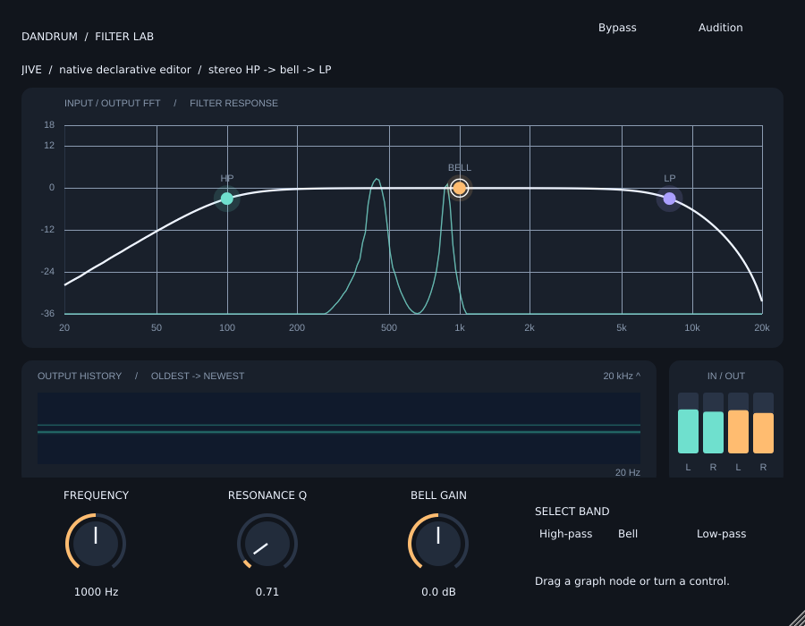
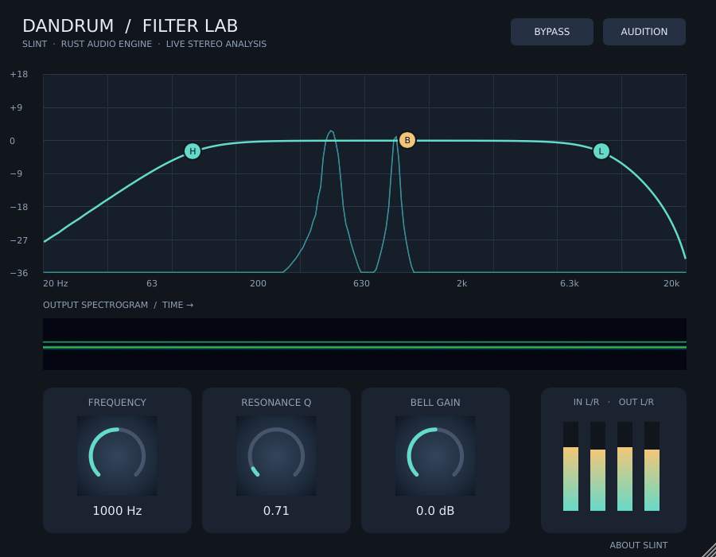

# Native filter UI experiments

Two optional stereo filter effects compare **JIVE 1.2.0** and **Slint 1.18.1** inside JUCE. Both use the same Rust high-pass → bell → low-pass graph, nine host parameters, state/bypass handling and analysis model. These are working experiments; production instrument UIs are unchanged.

From Dandrum:

```bash
./demo filter-jive
./demo filter-slint
```

Choose **Audition** for a quiet generated noise/sine signal, or send stereo input through the effect. Drag H/B/L nodes to choose a band and change its frequency/resonance or gain. The knobs edit the selected band; Bell Gain edits the bell. Both show a Rust-derived response, live input/output FFT, scrolling output history and four level meters. Slint includes an **About Slint** attribution screen.

The launcher uses an isolated `build/filter-ui-spikes/` Release/native-only configuration, skips npm, and forwards demo arguments. First launch fetches pinned framework sources and builds native dependencies. Slint additionally builds its Rust runtime/compiler and requires Rust ≥1.92; the recorded toolchain was Rust 1.96/CMake 3.30.9/GCC 11.4/JUCE 8.0.6 on Linux.

## Result

**Adopt JIVE for the next native UI experiment. Revise Slint's embedding/rendering approach before production adoption. Defer production migration for both.** JIVE fits the existing JUCE event loop and component model directly, uses less CPU here, and needs no separate platform adapter. Slint expresses more visual behaviour in a typed declarative language that feels closer to frontend work, but this integration required a custom platform, pixel presentation, event forwarding and viewport synchronization.

JIVE uses C++ ValueTrees for layout/styles, and specialised visuals still use JUCE drawing. Slint uses `.slint` components and generated C++ bindings. Each renderer has its own controls and painting; shared code contains only audio, parameters and numeric analysis. Editor component files remain under 200 lines (largest 168).

| One editor, active audio | JIVE | Slint software |
|---|---:|---:|
| Whole native harness PSS | 28.7 MiB | 31.1 MiB |
| CPU, percent of one core | 12.5% | 18.4% |
| Full 900×700 offscreen raster, median | 2.31 ms | 2.73 ms |
| Same raster, p95 | 3.46 ms | 4.17 ms |

These are native harness process figures, including its Rust DSP/audio worker, rather than plugin-only RAM or host-baseline deltas. Both redraw/analyse at 30 Hz even during silence; idle suppression is an obvious next optimisation. The measurements do not establish physical knob-to-screen latency. See the [full resource report and raw evidence](../../docs/resource-measurements/2026-10-07-filter-ui-spikes/README.md).

| JIVE | Slint |
|---|---|
|  |  |

## Verification and boundaries

Both Standalone and VST3 targets build. Nine owning CTest checks pass: signed stereo Rust output, shared state/bypass/analysis/gestures, both interactive editors, both actual VST3 bundles in a JUCE host, and three launcher checks. Host tests verify nine stable parameter IDs, exact bypass, state restore, independent simultaneous editors, visible host changes and reopen. Native X11 window captures include the embedded plugin's pixels; proxy component snapshots alone were insufficient.

```bash
PATH=/usr/bin:/bin:$PATH $HOME/.local/bin/cmake -S . -B build/filter-ui-spikes \
  -DDANDRUM_NATIVE_ONLY=ON -DDANDRUM_BUILD_FILTER_UI_SPIKES=ON -DCMAKE_BUILD_TYPE=Release
PATH=/usr/bin:/bin:$PATH CARGO_BUILD_JOBS=3 $HOME/.local/bin/cmake --build build/filter-ui-spikes \
  --parallel 3 --target dandrum-filter-ui-spikes-all
# Run with your existing X11 DISPLAY; measured session used DISPLAY=:10.
$HOME/.local/bin/ctest --test-dir build/filter-ui-spikes -R '^(filter-|demo-launcher)' --output-on-failure
```

Actual UI verification covers 900×700, 1080×760 and VST3 resize 1280×900 on a scale 1 Linux/X11 display. It uses synthetic mouse-method events/rotary callbacks and host automation. Physical input/display latency, HiDPI, Windows/macOS, DAW-specific deployment, IME and complete accessibility bridging remain unverified. The Slint backend is full-buffer software rendering; GPU Slint renderers were not evaluated. Its software Path/transform/shadow limitations are documented in [Slint notes](slint/NOTES.md). JIVE integration details are in [JIVE notes](jive/DEVELOPMENT.md). The [evidence map](EVIDENCE.md) connects the experiment's criteria and tasks to checks.

Analysis uses mono-folded 2048-point spectra and 8192-sample Rust impulse responses, so narrow low-frequency features are approximations. The visible response view clips outside −36..+18 dB. This is an evaluation instrument, not a finished analyser or a production migration.

## Slint design-guide styling

The Slint filter view follows the maintained [design guide](../../docs/design-system/README.md):
warm brown stepped surfaces, cream response/value marks, ember selection, flat
pointer-free caps with a 270-degree arc and origin tick, and small panel/control
radii. Labels use embedded Barlow Semi Condensed, the lowercase wordmark uses
Barlow Bold, and values use JetBrains Mono. Knob values appear on hover, drag or
focus; the existing normalized drag/host gesture contract remains unchanged.
Numeric text entry and a production UI migration are outside this visual pass.

The theme imports the generated Slint projection of `ui/design-system/tokens.json`;
`node scripts/generate-ui-tokens.mjs --check` detects drift across all three
renderers. The owning Slint runtime check covers knob hover/focus values, band
and knob drags, host gestures, attribution, two instances and resize captures.

GNU Make builds clear inherited `MAKEFLAGS`/`MFLAGS` only for the Cargo-built
Slint compiler. This avoids jemalloc treating Make's compact silent flag `s`
as a target name; Cargo retains its own jobserver flags and explicit
`CARGO_BUILD_JOBS` setting. The regression check uses real GNU Make and Cargo
with jemalloc's flag concatenation, and also covers a prebuilt Slint SDK.
